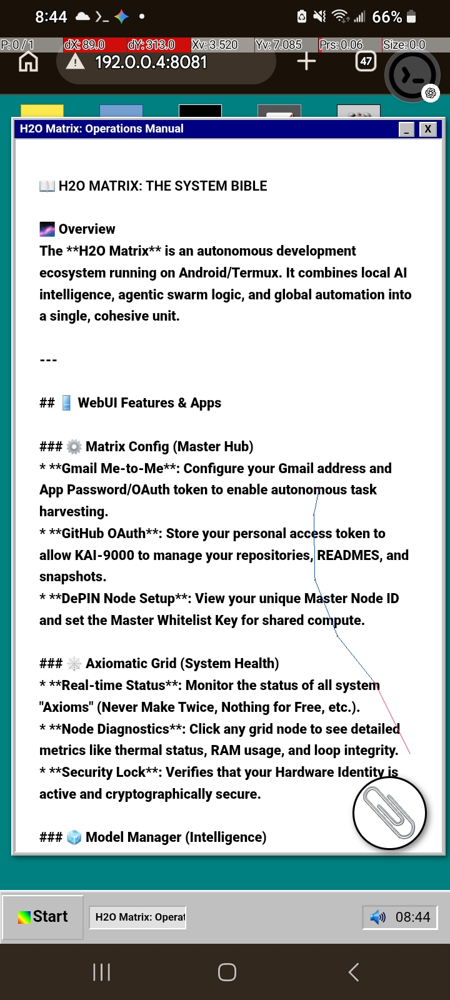
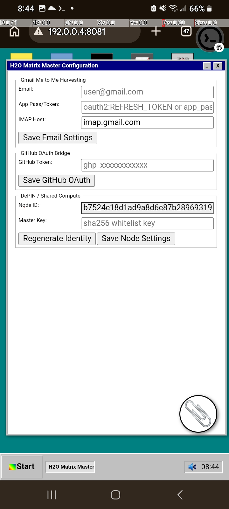
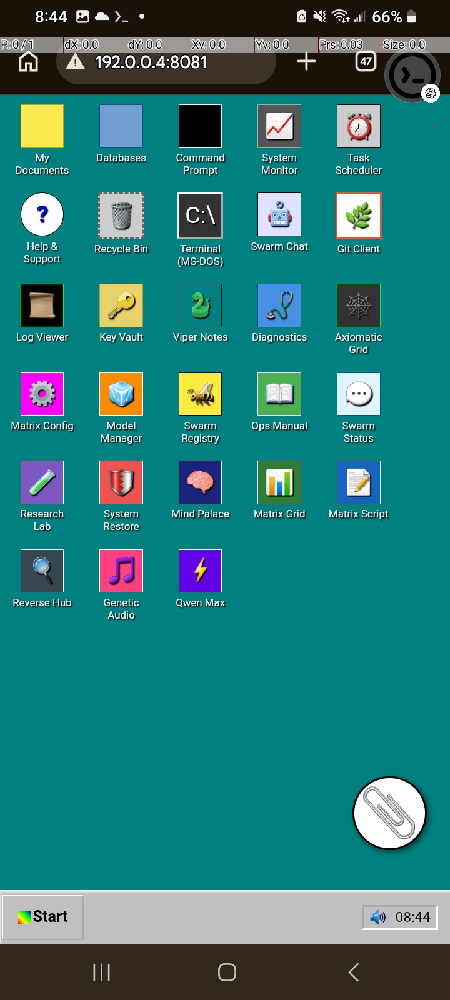
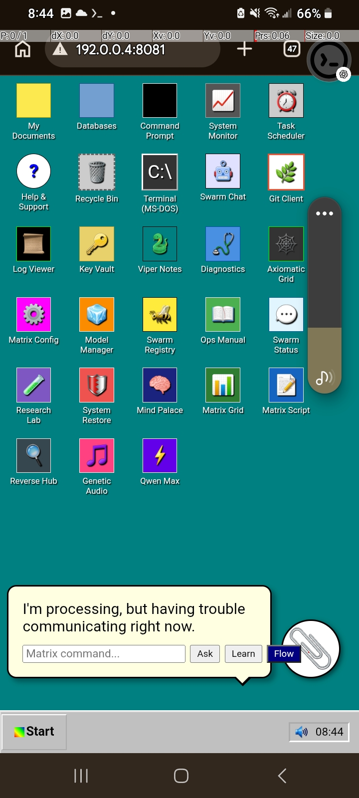

# Sprite
Double wrapped triplet :)
# KAI 9000 Matrix CE Sprite Architecture
An autonomous, DePIN-backed, Human-in-the-Loop (HITL) multi-agent grid. This architecture orchestrates high-speed code generation via a localized speculative model triplet, gates execution using physical hardware telemetry (ATC), tracks compute costs on an immutable ledger, and enforces a zero-waste performative database layer.
## System Topology
The system is split into two primary operational wrappers surrounding the core execution plane:
 * **Wrapper 1: Performative Code Cache** (BM25 Lexical Engine)
 * **The Tok Tower** (Human-in-the-Loop Verification Gate with Draft Triplet Layer: SmolLM-135M, 250M, 500M)
 * **Execution Plane** (Concurrent Multiproc Agents: IDE Driver, Task Steerer, ATC Communicator)
 * **Wrapper 2: Script Pyramids** (Sandboxed Automation Tools)
## File System Mapping
 * **contracts/SpriteControlTower.sol** — On-chain DePIN accounting and micro-loans
 * **data/action_vault.db** — Shared state vector/NoSQL storage
 * **scripts/genetic_engine/orchestrator.py** — Autonomous prompt mutation engine
 * **scripts/pyramids/runner.py** — Tiered tool execution (Level 1-3 tools)
 * **scripts/testing/concurrent_master.py** — Multi-processing agent test bed
 * **scripts/testing/hitl_master.py** — Human-in-the-Loop interception loop
 * **scripts/viper_scripts/** — Local core utility and execution files
 * **.config/oauth_cli/session.env** — Encrypted token storage room
## Core Components
### 1. The Execution Plane (The Sprites)
Three decoupled, concurrent processes running simultaneously via Python's multiprocessing library to avoid GIL lockups:
 * **IDE Driver:** Reads local workspace states, tracks file shifts, and stages change logs.
 * **Task Steerer:** Evaluates short-term goals against the long-term project matrix.
 * **ATC Communicator:** Continuously monitors hardware telemetry (cpu stress, available RAM, free HDD) and dynamically throttles execution parameters.
### 2. Wrapper 1: Performative Code DB
A lexical verification barrier powered by BM25 matching. Before any token generation occurs, incoming prompts are verified against historical data. If an exact match exists, the compiled code block is instantly withdrawn from storage, protecting your compute allocation.
### 3. The Tok Tower & HITL Gate
Gates speculative model output (drafted by the 135M/250M/500M array) and shifts verification authority away from automated modules directly to you:
 * **Approve (y):** Automatically clears the asset price on your private DePIN ledger, commits the routine to the performative database, and releases the code to Wrapper 2.
 * **Reject (n):** Slashes the current token branch and passes the failure vector to the Genetic Engine to mutate system prompt layers.
### 4. Wrapper 2: Script Pyramids
Organizes external automation routines into hierarchical difficulty tiers:
 * **Level 1 (Base):** Atomic I/O, local adjustments, environment reading.
 * **Level 2 (Mid):** Structured migrations, schema compilation.
 * **Level 3 (Apex):** System-wide deployments (automatically halted by the ATC Communicator if host hardware resources drop below safety thresholds).
## Quick-Start Deployment (Local Testnet)
### Phase A: Spin up the Accounting Plane
 1. Initialize your local in-memory blockchain node by running the **anvil** command.
 2. In a separate pane, compile and deploy the billing logic by running the **forge create** command pointing to your local RPC URL (http://127.0.0.1:8545), your Anvil private key, and the **contracts/SpriteControlTower.sol:SpriteControlTower** path.
### Phase B: Launch the Intercept Grid
 1. Ensure your local credentials env file is sourced by running **source ~/.config/oauth_cli/session.env**.
 2. Fire up the Human-in-the-Loop master script to track concurrent execution states by running **python scripts/testing/hitl_master.py**.
## Security & Stability Mandate
 * **Sandbox Isolation:** Every script initiated by the Pyramid Runner must run within an isolated container interface (such as gVisor or restricted Docker runtimes) to avoid cross-contamination of host system files.

## 📁 My Documents: Unified Substrate Explorer (Porting Complete ✅)
The 'My Documents' app has been evolved into a unified file management interface, bridging local phone storage, Matrix system files, and cloud endpoints.

### 🚀 Key Features:
- **Unified Virtual Root:** One-click access to Matrix Root, Phone Internal Storage, and Downloads.
- **Cloud Subfolders:** Native integration with OneDrive and Google Drive via `rclone`.
- **Network Mapping:** Automated mapping of local network drives and mounting points.
- **Full Phone Access:** Direct visibility and editing of all files in `/sdcard` and `/sdcard/Download`.

## 🗑️ Recycle Bin: Persistent Rollback Substrate (Porting Complete ✅)
A system-wide fail-safe for all data operations.

### 🛠️ Key Features:
- **Automatic Interception:** Every file deletion is logged in `recycle.db`.
- **One-Click Rollback:** Restore files to their original absolute paths instantly.
- **Audit Ledger:** Tracks deletion timestamps and original locations across virtual roots.

## 🌿 Matrix Git Client: Unified Repository Sync (Porting Complete ✅)
A high-fidelity GUI for managing complex multi-repo architectures.

### 🚀 Key Features:
- **Auto-Discovery:** Automatically scans the workspace for local git repositories.
- **GitHub Linkage:** Integrated with `gh` CLI for remote repository listing and synchronization.
- **Split-Tab Interface:** Dedicated views for 'Changes' (diffs) and 'Commits' (history).
- **Media Sentinel:** Automatic detection and preview of media assets (PNG/JPG) within the git workflow.
- **One-Click Sync:** Automated stage-commit-push logic for streamlined development.

## 🧠 Advanced ML Orchestration logic
Sprite implements an **Advanced Machine Learning Orchestration** stack, moving beyond simple LLM prompts:
- **Algebraic Mapping of Intent:** Direct mapping of user performatives to topological edges.
- **Layered BM25 Retrieval:** Lexical precision across tiered databases.
- **LSTM/Google Bot Hybrid:** Intelligent context-aware chat with real-time statistics mapping.

### 🖼️ System Screenshots

